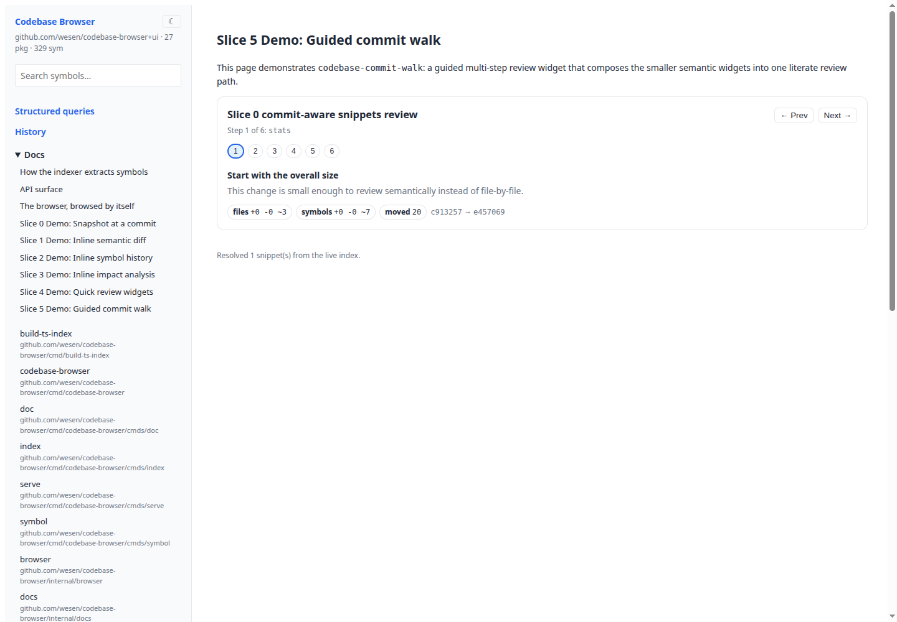
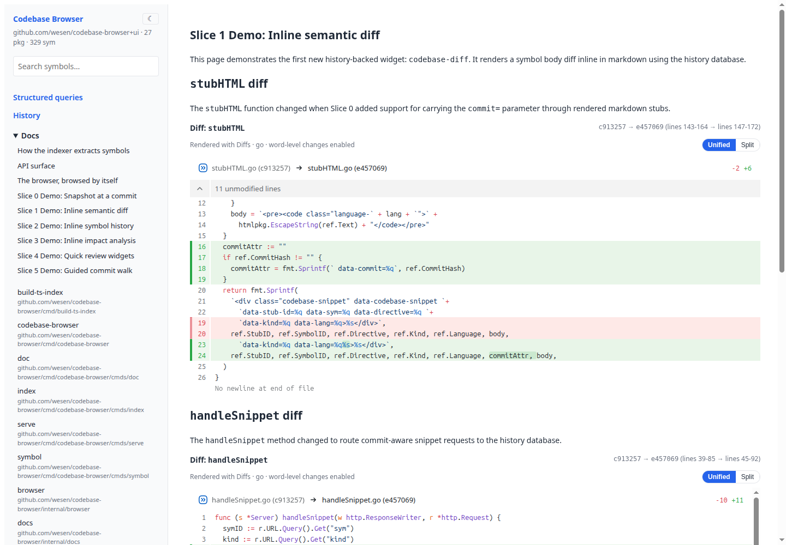
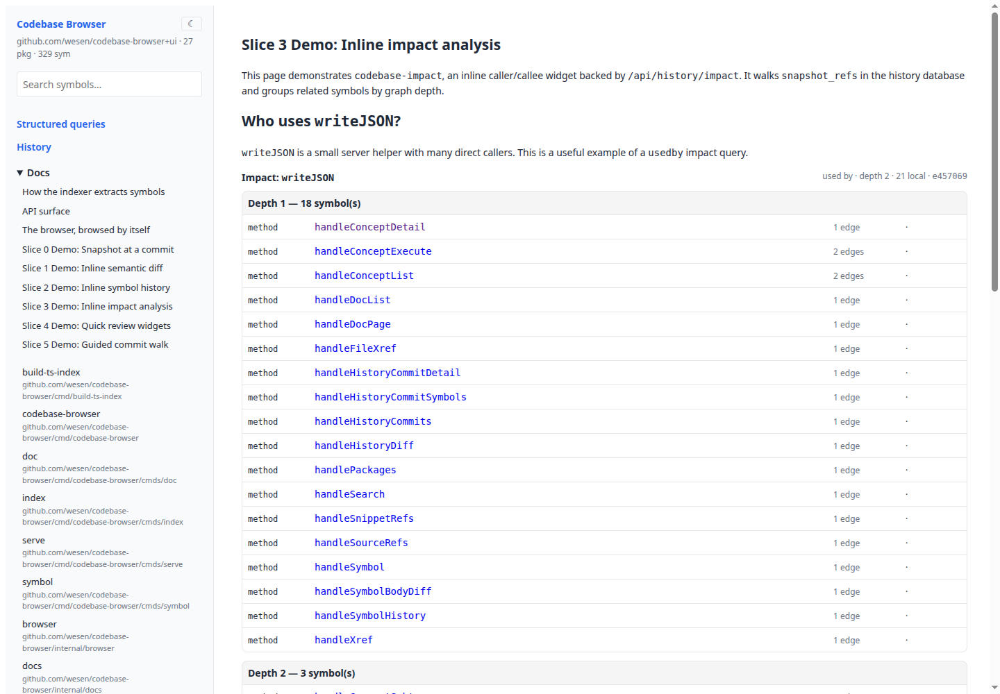
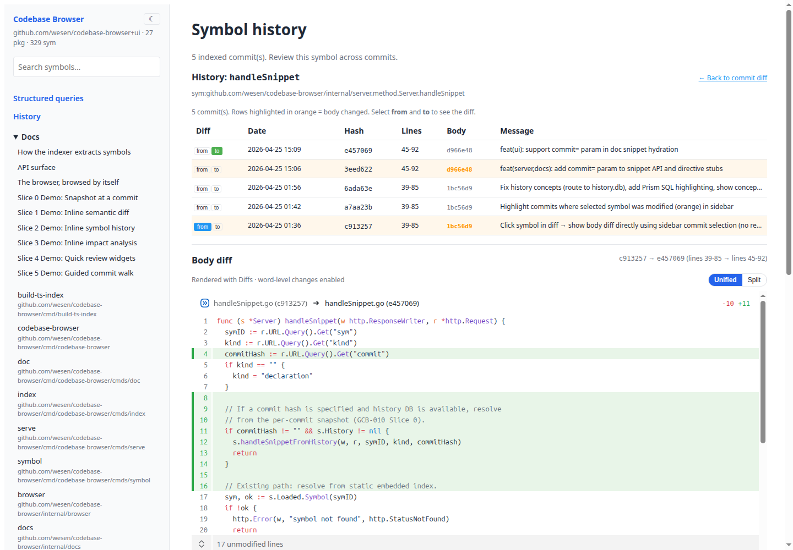

# codebase-browser

Turn a code review into a static, shareable browser. `codebase-browser` indexes a commit range, source files, symbols, references, and markdown review notes into a SQLite database. Then `review export` packages a React application and that SQLite database into a standalone directory. The browser opens `db/codebase.db` locally with [sql.js](https://sql.js/) — no Go server, no runtime API calls.

Reviewers can read prose, inspect symbol diffs, follow callers and callees, browse source files, and query the same database with SQL or an LLM.

## Why

- **Static, shareable artifacts.** Export a directory anyone can serve with any static file server. No Go process at read time.
- **SQLite as the runtime boundary.** The indexer writes SQLite; the browser reads SQLite; an LLM reads the same SQLite file. One artifact for human and machine consumers.
- **Symbol-level diffs and history.** Instead of reviewing only file-level patches, embed symbol-level diffs, impact graphs, and history timelines directly in prose review guides.
- **Review guides as markdown.** Write review notes in markdown with special fenced blocks that become interactive widgets in the exported browser.

## Feature tour

### Literate review guides

Markdown docs can embed guided, interactive review flows. The `codebase-commit-walk`
widget composes smaller semantic widgets into a step-by-step walkthrough:
start with change size, inspect files, drill into a symbol diff, zoom in on an
annotated snippet, check history, and finish with impact.



### Semantic symbol diffs

Instead of reviewing only file-level patches, docs can embed symbol-level diffs
for a specific function or method across two commits. Diff rendering is powered
by `@pierre/diffs`, with word-level highlighting, a unified/split toggle, and
lazy-loaded Shiki syntax highlighting scoped at runtime to Go/TypeScript/TSX.



### Impact analysis

Impact widgets show callers/callees around a symbol directly inside the review
narrative, with local symbols linked back into history-backed routes.



### History-backed symbol pages

Deep links such as `/history?symbol=...` open a focused symbol-history view with
per-commit body hashes and the same Diffs-powered body diff renderer used in
embedded review guides.



## Quick start

Prerequisites: Go 1.22+ and optional Docker for the hermetic Dagger build path. Node 22+ and pnpm 10.x are needed when building the static browser frontend.

```bash
# 1) Optional: install UI deps
pnpm -C ui install

# 2) Build the CLI
make build

# 3) Write a review guide with embedded widgets
mkdir -p ./reviews
cat > ./reviews/pr-42.md << 'EOF'
# PR #42: Add strict mode to Extract

## Changes

```codebase-diff sym=staticapp.Export from=HEAD~1 to=HEAD
```
EOF

# 4) Index commits and review docs into SQLite
./bin/codebase-browser review index \
  --commits HEAD~10..HEAD \
  --docs ./reviews/pr-42.md \
  --db /tmp/pr-42.db

# 5) Export a static browser bundle
./bin/codebase-browser review export \
  --db /tmp/pr-42.db \
  --out /tmp/pr-42-static

# 6) Serve with any static file server
python3 -m http.server 8784 --directory /tmp/pr-42-static
# open http://localhost:8784/#/
```

The exported browser loads `manifest.json`, opens `db/codebase.db` with sql.js, and answers code navigation questions locally. There is no Go runtime server and no `/api/*` requests.

## Architecture

```
Git commit range ──▶ indexer (Go) ──▶ SQLite review DB
                                     │
                                     ▼
                    review export ──▶ static directory
                                        ├── index.html
                                        ├── manifest.json
                                        ├── db/codebase.db   ◀── browser opens with sql.js
                                        └── WASM assets
```

The exported directory is a static React SPA. No Go server runs at read time.
Query engine is `sql.js` (SQLite compiled to WebAssembly). All data requests
go to the local SQLite file, not to `/api/*` endpoints.

For documentation on writing review guides, run:

```bash
./bin/codebase-browser help user-guide          # tutorial
./bin/codebase-browser help db-reference         # schema reference
./bin/codebase-browser help markdown-block-reference  # directive reference
```

## Adding a doc page

Drop a markdown file under `internal/docs/embed/pages/`. Any fenced block with an info string of `codebase-snippet`, `codebase-signature`, or `codebase-doc` is replaced at render time with the named symbol's body, signature, or godoc.

Short refs work for unambiguous cases: `github.com/.../indexer.Merge`.
Use full `sym:` IDs when a name collides across files in the same package.

## Repo layout

```
cmd/codebase-browser/     Main CLI (glazed commands: review, history, index, query, symbol)
cmd/build-ts-index/       Dagger orchestrator for the Node TS extractor
internal/indexer/         Go AST → Index JSON + Merge
internal/browser/         Index loader shared by CLI and indexing paths
internal/review/          Git/review document indexing into SQLite
internal/staticapp/       Standalone sql.js export packaging
internal/sourcefs/        Source tree embed (for snippet slicing)
internal/indexfs/         index.json embed + go:generate wiring
internal/docs/            Markdown renderer + embedded doc pages
internal/history/         Git-aware history: per-commit snapshots, diffs
tools/ts-indexer/         Node + TS Compiler API extractor
ui/                       React SPA (RTK-Query + Storybook, sql.js browser layer)
pkg/doc/                   Glazed help pages (user-guide, db-reference, markdown-block-reference)
ttmp/                      Ticket workspaces (docmgr)
```

## Testing

```bash
make test                 # go test ./... (indexer, docs, review, static export)
pnpm -C ui run typecheck  # tsc --noEmit for the SPA
pnpm -C tools/ts-indexer test  # vitest (extractor + xref + JSX fixtures)
make smoke                # build the CLI and run --help
make docs-smoke           # smoke-test docs examples (create DB, export, verify)
```

## Documentation

Help pages embedded in the binary (run `./bin/codebase-browser help <topic>`):

| Topic | Description |
|-------|-------------|
| `user-guide` | Tutorial: write review markdown guides with ` ```codebase-* ``` ` blocks |
| `db-reference` | Schema reference and SQL query patterns for the review SQLite database |
| `markdown-block-reference` | Canonical reference for every `codebase-*` directive |

Tickets and design docs live under `ttmp/`:

- **GCB-015** — static sql.js browser implementation.
- **GCB-014** — architecture redesign from embedded-index to sql.js export.
- **GCB-001** — original design and 10-phase implementation plan.
