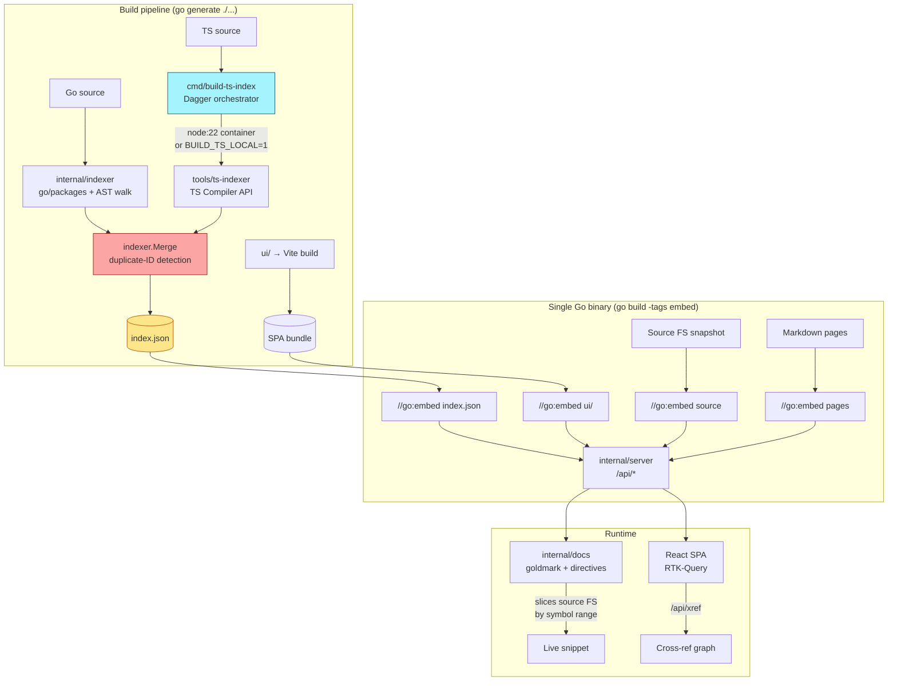

# Codebase Browser

This project is a single-binary documentation browser for Go and TypeScript codebases. A build-time indexer walks the AST of both languages, a Go binary embeds the resulting `index.json` and a snapshot of the source tree, and a small React SPA renders packages, files, symbols, cross-references, and markdown doc pages — all served from one binary with no runtime dependencies. The browser can document itself: markdown pages embed live source via `codebase-snippet sym=<id>` directives that resolve against the embedded index at request time.

> [!summary]
> The project has three identities that reinforce each other:
> 1. a **static-analysis pipeline** that unifies Go (`go/packages`) and TypeScript (TS Compiler API) into one schema-shared index
> 2. a **Dagger-orchestrated build system** that runs Node tooling hermetically from Go while preserving a local-pnpm fallback
> 3. a **self-hosting doc server** whose markdown pages embed live source snippets across both languages

## Why this project exists

A lot of project documentation slowly rots because it references code by copy-paste. When the code moves or changes signature, the docs don't follow. The codebase-browser flips the relationship: markdown pages reference a stable symbol ID, and the renderer slices the actual bytes of that symbol's declaration out of the embedded source FS at request time. If the code changes, the rendered snippet changes; if the symbol is deleted, the page fails loudly rather than silently lying.

Once you commit to a stable symbol-ID scheme for one language, adding a second language is mostly schema reconciliation. The GCB-002 ticket demonstrates this: a ~450-line Node extractor brings TypeScript into the same index the Go side produces, and nothing downstream — server, frontend, xref endpoint, doc renderer — needed language-specific changes.

Secondary goals:

- **Ship documentation with the library**: the browser is one statically-linked Go binary. Put it in your release tarball and readers can browse without cloning.
- **Prove cross-language static-analysis patterns**: Go's AST is well-documented territory; TS's Compiler API + alias-following via `TypeChecker` is less so, and was worth writing up.
- **Demonstrate a production Dagger pipeline**: the `go-web-dagger-pnpm-build` skill existed as a vault-level pattern before this project, but the skill's canonical reference was Smailnail. This project is a second working instance.

## Current project status

Shipped through phase 7 of GCB-002. The loose-ends sweep (Dagger smoke, meta doc page, README, `.gitignore`, `go:generate` wiring, xref `null`-versus-`[]` fix) is also in.

Current index on the repo itself:

- **27 packages** (16 Go + 11 TS)
- **73 source files**
- **310 symbols** (134 Go + 176 TS)
- **959 cross-reference edges** (855 Go + 99 TS + merge-overlap)
- **byte-identical** output between Dagger and local-pnpm code paths (sha256-verified)

What works end-to-end:

- `go generate ./...` builds the Vite SPA, runs both extractors, merges, and writes `internal/indexfs/embed/index.json`
- `go build -tags embed` produces a self-contained binary
- `/api/*` serves packages, symbols, sources, snippets, search, xref, doc pages
- React SPA renders all of it with language-aware syntax highlighting (Go tokens, TS + JSX component recognition)
- Doc pages embed live source via `codebase-snippet sym=...` directives; the meta page (`03-meta.md`) documents the browser itself with six cross-language directives

Still open (all nice-to-have, none shipping-blocking):

- GitHub Actions CI for the embed-tag build + doc-page validator
- README screenshot (deferred by user)
- `<Foo.Bar>` JSX member-access highlighting polish
- Publish `@codebase-browser/ui` package (explicitly scoped out)

## Project shape

Five conceptual layers, stacked bottom-up:

1. **Extractors** (`internal/indexer/`, `tools/ts-indexer/`) — Go + TS code walkers that emit records in a shared JSON schema.
2. **Merge + embed** (`internal/indexer/multi.go`, `internal/indexfs/`) — combine per-language parts into one index, detect duplicate IDs, embed via `//go:embed`.
3. **Server** (`internal/server/`) — language-agnostic `/api/*` handlers over the loaded index + source FS.
4. **Doc renderer** (`internal/docs/`) — goldmark-based markdown with `codebase-snippet`/`codebase-signature`/`codebase-doc` directives that slice bytes from the source FS by symbol range.
5. **Frontend** (`ui/`) — React + RTK-Query SPA with a themable component package (`@codebase-browser/ui`), Storybook, language-dispatched tokenizer for highlighting.

## Architecture



Key code locations:

- `cmd/codebase-browser/` — main CLI (glazed commands: `serve`, `index build`, `doc list`, `symbol find`)
- `cmd/build-ts-index/main.go` — Dagger orchestrator (opportunistic, falls back to `BUILD_TS_LOCAL=1`)
- `internal/indexer/extractor.go` — Go extractor (`packages.Load` with `NeedSyntax|NeedTypesInfo|...`)
- `internal/indexer/xref.go` — Go cross-reference pass (`types.Info.Uses`)
- `internal/indexer/multi.go` — `Extractor` interface + `Merge()` with dup-ID errors
- `internal/indexer/id.go` — stable ID scheme `sym:<importPath>.<kind>.<name>`
- `tools/ts-indexer/src/extract.ts` — TS Compiler API two-pass (symbols + refs)
- `tools/ts-indexer/src/cli.ts` — Node CLI consumed by the Dagger container
- `internal/server/server.go` — route table for `/api/*`
- `internal/docs/renderer.go` — goldmark + `codebase-*` fenced-block resolution
- `internal/docs/embed/pages/03-meta.md` — self-documenting doc page
- `ui/src/packages/ui/src/` — themable widget package (Code, SymbolCard, TreeNav, ...)
- `ui/src/packages/ui/src/highlight/ts.ts` — TS tokenizer with JSX component recognition

## Implementation details

### The shared schema

The whole design rests on the single `types.go` shape in `internal/indexer/`. Five records:

```go
type Index struct {
    Version, GeneratedAt, Module, GoVersion string
    Packages []Package
    Files    []File
    Symbols  []Symbol
    Refs     []Ref
}

type Symbol struct {
    ID, Kind, Name string          // kind ∈ {func, method, class, iface, struct, type, alias, const, var}
    PackageID, FileID string
    Range Range                    // line/col for display + byte offsets for slicing
    Doc, Signature string
    Receiver *Receiver             // method receiver (Go) or class container (TS)
    Exported bool
    Language string                // "go", "ts"
}
```

The TS-side mirror at `tools/ts-indexer/src/types.ts` is byte-compatible JSON. A `Language` field on `Package`, `File`, and `Symbol` lets the frontend route to the right tokenizer without having to parse IDs.

### Symbol IDs are the invariant

```
Go:  sym:github.com/wesen/codebase-browser/internal/indexer.func.Merge
TS:  sym:ui/src/packages/ui/src/TreeNav.iface.TreeNavProps
```

Two rules make these stable:

1. **Go**: `<importPath>.<kind>.<name>` with method form `<importPath>.method.<Recv>.<Name>`. Path moves within the module don't break IDs; only import-path renames do.
2. **TS**: `<moduleName>/<relative-file-stem>.<kind>.<name>`. File-scoped because TS doesn't have Go's "one name per directory" rule — Storybook's `const meta` in every `*.stories.tsx` file would otherwise collide. The package-ID (directory-scoped) is still used for tree-nav grouping; only the *symbol* scope is file-scoped.

The `pathPrefix` concept (see `extract.ts`) splits two conflicting needs:

- `File.path` is prefix-rooted (`ui/src/...`) so the server's source FS (rooted at repo root) can resolve files across languages.
- Symbol-ID scope is prefix-free (`ui/src/...`, no `ui/` prefix required in the ID) so moving the TS project from `ui/` to `web/` doesn't invalidate every `codebase-snippet` directive referencing a TS symbol.

### Cross-references mirror between languages

Go uses `packages.Config{Mode: NeedSyntax|NeedTypesInfo|...}` and walks function bodies with `ast.Inspect`, asking `p.TypesInfo.Uses[ident]` for each identifier. A small `objectToSymbolID(obj types.Object)` adapter maps `types.Func` / `types.TypeName` / `types.Const` / `types.Var` to the same ID scheme. Kind classification: `call` for `*types.Func`, `uses-type` for `*types.TypeName`, `reads` for `*types.Const` and `*types.Var`.

TypeScript mirrors the approach. The extractor is two-pass: pass 1 registers every emitted declaration in `Map<ts.Declaration, string>`; pass 2 walks function and method bodies, calling `checker.getSymbolAtLocation(ident)` on each identifier. Named imports resolve to *alias* symbols pointing at the `ImportSpecifier`, so we detect `SymbolFlags.Alias` and follow with `checker.getAliasedSymbol` to reach the real exported declaration.

Ref-kind classification mirrors Go:

```ts
function refKindFor(sym: ts.Symbol): string {
  if (sym.flags & (SymbolFlags.Function | SymbolFlags.Method)) return 'call';
  if (sym.flags & (SymbolFlags.Class | SymbolFlags.Interface
                   | SymbolFlags.TypeAlias | SymbolFlags.Enum)) return 'uses-type';
  if (sym.flags & (SymbolFlags.Variable | SymbolFlags.BlockScopedVariable)) return 'reads';
  return 'use';
}
```

### Dagger orchestration for the Node toolchain

`cmd/build-ts-index/main.go` mounts `tools/ts-indexer/` + the target module into a `node:22-bookworm` container, pnpm-installs with a `CacheVolume` store, compiles the extractor with `tsc`, and runs `node bin/cli.js` with `--path-prefix` plumbing. The exported `/out/index-ts.json` lands on the host. `BUILD_TS_LOCAL=1` switches to local `pnpm + node` for Docker-less machines.

Bit-identical output between paths (sha256-verified on the `ui/` tree) is the invariant that keeps the two paths honest. If the container ever drifts (different Node version, different pnpm install order), the hash diverges and we notice.

### The `codebase-snippet` doc-directive

The goldmark preprocessor scans for fenced blocks with info strings `codebase-snippet`, `codebase-signature`, or `codebase-doc`. For each, it looks up the symbol, slices the source FS by `Range.StartOffset..EndOffset`, and replaces the fenced block with the resolved text. The directive is the only thing keeping doc-pages honest — if a referenced symbol is renamed or deleted, `resolveSymbol` errors loudly rather than silently returning stale text.

Full `sym:` IDs are needed when a name collides across files in the same package (common in TS); short `pkg.Name` works for Go where package-scope name uniqueness is a language rule.

### Why Dagger instead of in-process tree-sitter?

Tree-sitter-typescript exists as a pure-Go option. Rejected for two reasons: (1) no type info means no reliable xref — `Array<number>` vs `<Foo prop>` vs `foo<bar>()` all parse but the semantic disambiguation TS Compiler API gives you is the thing that makes xref work; (2) generics and JSX have enough grammar quirks that a weekend tree-sitter integration would lose more than it gains. The Node dependency is real but scoped to build-time, not runtime.

## Current user-facing commands

```bash
# Dev loop
make dev-backend              # :3001 — serves from disk, no embed
make dev-frontend             # :3000 — Vite + proxy to :3001

# One-shot build → embedded binary
make build                    # go generate ./... && go build -tags embed
./bin/codebase-browser serve --addr :3001

# Granular index builds
go run ./cmd/codebase-browser index build --lang go       # Go only
go run ./cmd/codebase-browser index build --lang ts       # TS only
go run ./cmd/codebase-browser index build --lang auto     # Both, merged

# Dagger smoke (requires Docker)
go generate ./internal/indexfs

# Local fallback (no Docker)
BUILD_TS_LOCAL=1 go generate ./internal/indexfs
```

## Important project docs

Repo-local (in `ttmp/`):

- `/home/manuel/code/wesen/2026-04-19--go-codebase-browser/ttmp/2026/04/19/GCB-001--go-codebase-browser-ast-indexed-embedded-themed/design-doc/01-go-codebase-browser-analysis-and-implementation-guide.md`
- `/home/manuel/code/wesen/2026-04-19--go-codebase-browser/ttmp/2026/04/19/GCB-001--go-codebase-browser-ast-indexed-embedded-themed/reference/01-investigation-diary.md`
- `/home/manuel/code/wesen/2026-04-19--go-codebase-browser/ttmp/2026/04/20/GCB-002--typescript-support-via-tsc-in-node-orchestrated-from-go-with-dagger/design-doc/01-typescript-extractor-design-and-implementation-guide.md`
- `/home/manuel/code/wesen/2026-04-19--go-codebase-browser/ttmp/2026/04/20/GCB-002--typescript-support-via-tsc-in-node-orchestrated-from-go-with-dagger/reference/01-investigation-diary.md`
- `/home/manuel/code/wesen/2026-04-19--go-codebase-browser/README.md`

The meta doc page (embedded in the binary) at `/docs/03-meta` when the server runs, or at `internal/docs/embed/pages/03-meta.md` on disk.

## Related notes

Companion drill-down:

- [[PROJ - Codebase Browser - Static Analysis and Dagger Pipeline]] — focused report on the two extractors and the Dagger-orchestrated Node container build

Cross-repo patterns:

- The Dagger pipeline follows the `go-web-dagger-pnpm-build` skill template (Smailnail was the first instance; codebase-browser is the second).

## Open questions

- Should the doc renderer also lint markdown pages at build-time for unresolvable symbol IDs? A CI step that starts the server, fetches every page, and fails on `symbol not found` would catch rename rot.
- Should the frontend expose a language filter on search? Today search is purely name-based; a `?lang=ts` filter is trivial but the UI real-estate isn't free.
- Should we index `.js` files? `tsconfig.allowJs: true` would surface them but mixes plain JavaScript into a TS-biased tokenizer. Defer until someone asks.
- Should the Go indexer emit refs for JSX-like patterns in doc comments or example blocks? Currently only real function/method bodies generate refs.
- Does the `sym:` ID scheme need a version byte if the format ever changes? So far no, but it's worth flagging for future-proofing.

## Near-term next steps

- GitHub Actions workflow: `go generate ./...` + `go build -tags embed` + `make test` + `pnpm -C tools/ts-indexer test`.
- Doc-page validator in CI (render all pages, fail on resolve errors).
- `<Foo.Bar>` JSX member-access highlighting (cosmetic polish from GCB-002 Phase 7 open questions).
- README screenshot once the UI has a representative polished view.

## Project working rule

> [!important]
> The extractor schema is the load-bearing contract. Keep `internal/indexer/types.go` and `tools/ts-indexer/src/types.ts` byte-identical in JSON shape — any drift must land as a schema-version bump with a migration, not a silent rename.
