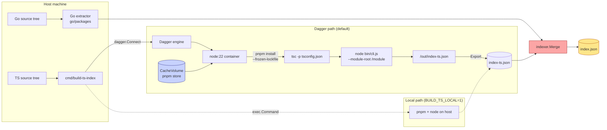

# Codebase Browser — Static Analysis and Dagger Pipeline

This is a drill-down companion to [[PROJ - Codebase Browser - Embedded Go+TS Doc Server with Live Source Snippets]] focused on two subsystems: (1) the two-language static analysis pipeline that extracts a unified `Index` JSON from Go and TypeScript source, and (2) the Dagger-orchestrated pnpm/Node container build that runs the TypeScript extractor hermetically from a Go command. Together these form the load-bearing build-time half of the project; everything downstream (server, SPA, doc renderer) just reads the JSON.

> [!summary]
> Two patterns that reinforce each other:
> 1. **Schema-first multi-language extraction** — one `types.go` shape, mirrored in TS, with stable symbol IDs as the join key; Go uses `go/packages` + `types.Info`, TS uses the Compiler API two-pass with `getAliasedSymbol`.
> 2. **Dagger-orchestrated Node tooling from Go** — a `node:22` container with a `CacheVolume`-backed pnpm store runs the TS extractor, exports `index-ts.json`, and falls back to local pnpm via `BUILD_TS_LOCAL=1`. Both paths produce byte-identical output (sha256-verified).

## Why this note exists

The GCB-002 design needed to answer a specific question: *can you add a second language to an existing AST-indexer without forking the schema, the server, or the runtime dependencies?* The answer turns out to be yes, but only if you commit up front to three things:

1. a shared schema with a `Language` field
2. ID schemes that can't collide across languages
3. a build orchestrator that keeps the Node toolchain scoped to build-time

This note captures the specifics of how each of those works in the codebase-browser so the pattern can be reproduced, or — more likely — extended with a third language.

## Current status

Both subsystems are shipped through GCB-002 Phase 7 + the loose-ends sweep:

- **Go extractor** (`internal/indexer/extractor.go`, `xref.go`, `multi.go`): 394 + 142 + 123 lines. Emits packages, files, symbols, and refs; uses `golang.org/x/tools/go/packages` with typed syntax.
- **TS extractor** (`tools/ts-indexer/src/extract.ts`, `cli.ts`): 450 + 71 lines of TypeScript. Emits the same four record types; runs on Node 22.
- **Merge** (`internal/indexer/multi.go`): detects duplicate IDs across languages, short-circuits on first collision (caught a real Storybook `const meta` bug during Phase 4).
- **Dagger pipeline** (`cmd/build-ts-index/main.go`): ~220 lines total. Opportunistic Dagger with synchronous local fallback.

Current output on the repo itself: 27 packages, 73 files, 310 symbols (134 Go + 176 TS), 959 refs. Dagger and local-pnpm code paths produce bit-identical JSON (sha256 `3542594924cfdead...` matches on both).

## Architecture



Key code locations:

- `internal/indexer/extractor.go` — Go extraction entrypoint
- `internal/indexer/xref.go` — Go cross-reference pass (function-body walk)
- `internal/indexer/multi.go` — `Extractor` interface + `Merge()` with dup-ID detection
- `internal/indexer/id.go` — `SymbolID`/`MethodID`/`PackageID` helpers
- `internal/indexer/types.go` — canonical schema
- `tools/ts-indexer/src/extract.ts` — TS Compiler API two-pass walker
- `tools/ts-indexer/src/ids.ts` — TS ID helpers (mirror Go's scheme)
- `tools/ts-indexer/src/types.ts` — schema mirror
- `tools/ts-indexer/src/cli.ts` — Node CLI the Dagger container invokes
- `cmd/build-ts-index/main.go` — Dagger orchestrator + local fallback
- `internal/indexfs/generate.go`, `generate_build.go` — `go:generate` wiring

## Implementation details

### The shared schema

All downstream consumers (server, renderer, SPA) are written against one Go struct family:

```go
type Index struct {
    Version, GeneratedAt, Module, GoVersion string
    Packages []Package
    Files    []File
    Symbols  []Symbol
    Refs     []Ref
}

type Symbol struct {
    ID, Kind, Name   string      // kind ∈ {func, method, class, iface, struct,
                                 //         type, alias, const, var}
    PackageID, FileID string
    Range    Range               // line/col + byte offsets
    Doc, Signature string
    Receiver *Receiver           // method receiver (Go) or class container (TS)
    Exported bool
    Language string              // "go", "ts" — empty defaults to "go"
}

type Ref struct {
    FromSymbolID, ToSymbolID, Kind string  // call | uses-type | reads | use
    FileID string
    Range  Range
}
```

The TS-side mirror at `tools/ts-indexer/src/types.ts` matches this in JSON. Keeping the two definitions in sync manually (no codegen) is tractable because the schema rarely changes and a codegen dep would be overkill. The `Language` field with `omitempty` lets pre-GCB-002 Go-only indexes still load without migration.

### Go extractor — `go/packages` + `types.Info`

The entry point is:

```go
cfg := &packages.Config{
    Mode: packages.NeedName | packages.NeedFiles | packages.NeedCompiledGoFiles |
          packages.NeedSyntax | packages.NeedTypes | packages.NeedTypesInfo |
          packages.NeedImports | packages.NeedModule,
    Dir:   absRoot,
    Fset:  token.NewFileSet(),
    Tests: opts.IncludeTests,
}
pkgs, err := packages.Load(cfg, opts.Patterns...)
```

`NeedCompiledGoFiles` is load-bearing: without it, `p.Syntax[i]` doesn't align with `p.CompiledGoFiles[i]`, and you can't map a `*ast.File` back to its on-disk path. This was a GCB-001 Phase 1 gotcha worth flagging for anyone reproducing the pattern.

Symbol extraction walks `pkg.Syntax` and emits one record per top-level declaration. Byte offsets come from `fset.Position(node.Pos()).Offset` and its `.End()` counterpart — these are what let the `/api/snippet` endpoint slice out exactly the declaration body in O(1).

### Go xref — `types.Info.Uses` as the join table

For each `*ast.FuncDecl` with a body, `ast.Inspect` walks every identifier. Each hit asks `p.TypesInfo.Uses[ident]` for the resolved `types.Object`, then a small adapter maps the object back to our symbol-ID scheme:

```go
func objectToSymbolID(obj types.Object) string {
    switch o := obj.(type) {
    case *types.Func:
        if sig, ok := o.Type().(*types.Signature); ok && sig.Recv() != nil {
            return MethodID(obj.Pkg().Path(), recvNameFromType(sig.Recv().Type()), obj.Name())
        }
        return SymbolID(obj.Pkg().Path(), "func", obj.Name(), "")
    case *types.TypeName: /* ... kind ∈ {type, iface, struct, alias} */
    case *types.Const:    /* ... */
    case *types.Var:      /* ... skip fields + parameters */
    }
}
```

Parameters, locals, and struct fields deliberately produce no ref (their ID targets don't exist in our index). Ref kind is classified per object type: `call` for `*types.Func`, `uses-type` for `*types.TypeName`, `reads` for consts/vars.

### TS extractor — two-pass with `TypeChecker`

TypeScript mirrors the Go shape but splits into two passes because:

1. TS lets you reference symbols declared later in the same file (unlike Go's file-order irrelevant but still-single-pass rules).
2. Named imports resolve to *alias* symbols, not directly to the exported declaration — you have to follow them.

Pass 1 (symbol extraction):

```ts
// For each declaration emitter, register in the decl-to-ID map.
if (ts.isFunctionDeclaration(node) && node.name) {
    const id = symbolID(importPath, 'func', name);
    addSymbol(idx, pkg, { id, kind: 'func', ... });
    declToSymbolID.set(node, id);
}
// Variable statements register each inner VariableDeclaration (not the
// containing statement) because the checker returns the VariableDeclaration
// as sym.declarations[0] for identifier uses.
```

Pass 2 (refs):

```ts
const checker = program.getTypeChecker();
for (const sf of projectFiles) {
    ts.forEachChild(sf, (node) => collectRefs(node, sf, fid,
        declToSymbolID, checker, idx));
}

// Inside the body walker:
let sym = checker.getSymbolAtLocation(n);
if (sym && sym.flags & ts.SymbolFlags.Alias) {
    try { sym = checker.getAliasedSymbol(sym); } catch { /* unresolvable */ }
}
const toID = resolveSymbolID(sym, declToSymbolID);
```

The alias-following is the whole reason a first naive implementation emits ~25% of the expected refs: every named import resolves to an `ImportSpecifier` declaration that isn't in `declToSymbolID`. Once you add `getAliasedSymbol`, refs jump to the 100-edge range on the `ui/` tree.

Binding positions (parameter names, variable declaration names, destructuring binding elements) are skipped to avoid noise — without the skip, a function emits a self-ref from its body to its own parameters.

### Symbol IDs as the stable invariant

```
Go:  sym:github.com/wesen/codebase-browser/internal/indexer.func.Merge
     sym:github.com/wesen/codebase-browser/internal/server.method.Server.handleXref
TS:  sym:ui/src/packages/ui/src/TreeNav.iface.TreeNavProps
     sym:ui/src/packages/ui/src/Code.func.Code
```

Design rules:

1. **Go**: `<importPath>.<kind>.<name>` / method `<importPath>.method.<Recv>.<Name>`. Moving files within a module doesn't break IDs — only import-path renames do.
2. **TS**: `<moduleName>/<relative-file-stem>.<kind>.<name>`. File-scoped because TS has no "one name per directory" rule. Storybook's `const meta` repeats in every `*.stories.tsx`; the package ID (directory) is still used for tree-nav grouping, only symbol IDs go file-scoped.

### `pathPrefix` — splitting two conflicting needs

The TS extractor takes a `--path-prefix` flag that defaults to empty. When passed (`--path-prefix ui`), it prefixes **only** `File.path`, not symbol-ID scope:

- `File.path = "ui/src/features/symbol/SymbolPage.tsx"` — resolvable against the server's source FS rooted at repo root.
- Symbol ID = `sym:ui/src/features/symbol/SymbolPage.func.SymbolPage` — file-stem-based, prefix-free at the scope level.

The reason: doc-page `codebase-snippet` directives reference symbol IDs, and IDs must survive "move the TS project from `ui/` to `web/`." Prepending `ui/` to the ID scope means every doc directive breaks after the move. Keeping `File.path` prefix-rooted but symbol-scope prefix-free gives you both stability and source-FS resolvability.

### Merge — dup-ID detection as a bug detector

```go
func Merge(parts []*Index) (*Index, error) {
    seenSym := map[string]string{}
    for _, p := range parts {
        for _, s := range p.Symbols {
            if prev, dup := seenSym[s.ID]; dup {
                return nil, fmt.Errorf("duplicate symbol id %q (languages: %s and %s)",
                    s.ID, prev, s.Language)
            }
            seenSym[s.ID] = s.Language
            out.Symbols = append(out.Symbols, s)
        }
    }
    // Also: duplicate package IDs, duplicate file IDs, sorted output.
}
```

Short-circuiting on first collision caught a real Storybook bug during GCB-002 Phase 4: `const meta` in every `*.stories.tsx` file was emitting the same ID because the TS symbol scope was directory-based. That forced the file-scoped ID fix described above. Without Merge's error, the bug would have been silent: whichever file landed in the array first would "win," and the others would be silently indexed as duplicates.

### Dagger orchestration

```go
container := client.Container().
    From("node:22-bookworm").
    WithEnvVariable("PNPM_HOME", "/pnpm").
    WithEnvVariable("PATH", "/pnpm:/usr/local/sbin:...").
    WithMountedCache("/pnpm/store", pnpmStore).
    WithDirectory("/ts-indexer", indexerSrc).
    WithDirectory("/module", moduleSrc).
    WithWorkdir("/ts-indexer").
    WithExec([]string{"sh", "-lc",
        "corepack enable && corepack prepare pnpm@10.13.1 --activate"}).
    WithExec([]string{"pnpm", "install", "--frozen-lockfile", "--prefer-offline"}).
    WithExec([]string{"pnpm", "run", "build"}).
    WithWorkdir("/module").
    WithExec([]string{"sh", "-lc",
        "if [ -f package.json ]; then pnpm install --prefer-offline --ignore-scripts || true; fi"}).
    WithExec([]string{"node", "/ts-indexer/bin/cli.js",
        "--module-root", "/module", "--tsconfig", "tsconfig.json",
        "--module-name", moduleName, "--out", "/out/index-ts.json",
        "--path-prefix", pathPrefix})

if _, err := container.File("/out/index-ts.json").Export(ctx, outPath); err != nil { ... }
```

Four design choices worth preserving:

1. **`CacheVolume` for the pnpm store** — `pnpm install --frozen-lockfile` on the `ui/` tree goes from ~60s cold to ~4s warm after the first run. Mounted at `/pnpm/store`.
2. **Narrow mounts** — only `tools/ts-indexer/` + the target module root. Both exclude `node_modules` so the host's install doesn't bleed into the container. Narrow mounts also reduce blast radius if someone points the tool at an untrusted project.
3. **Two-phase pnpm install** — first in `/ts-indexer` (frozen lockfile, pinned versions), then opportunistic `--ignore-scripts` in `/module` so the TS Compiler can resolve the target's external imports. Without the second install, the Compiler API emits `cannot find module` diagnostics for every import (symbols still correct, logs noisy).
4. **Opportunistic Dagger + local fallback** — `dagger.Connect` errors wrap as `errDaggerUnavailable`, the Go caller unwraps that specific error and shells to local `pnpm + node` instead. `BUILD_TS_LOCAL=1` forces the local path even when Dagger is available (for tight dev loops).

### Bit-identical output between paths

This is the invariant that keeps the two paths honest:

```bash
# Dagger path
go generate ./internal/indexfs
sha256sum <(jq -S 'del(.generatedAt)' internal/indexfs/embed/index-ts.json)
# 3542594924cfdead1c603a1aa880432e383fbdd11954e019f4e1ad397690fcb7

# Local path
BUILD_TS_LOCAL=1 go run ./cmd/build-ts-index
sha256sum <(jq -S 'del(.generatedAt)' internal/indexfs/embed/index-ts.json)
# 3542594924cfdead1c603a1aa880432e383fbdd11954e019f4e1ad397690fcb7
```

If the container ever drifts (different Node version, different pnpm install order), the hash diverges and we notice immediately.

## Common failure modes (found the hard way)

### 1. Missing `NeedCompiledGoFiles` in `packages.Config`

Without it, `p.Syntax[i]` doesn't align with a discoverable on-disk path. Symptom: panics or empty `File.path`. Found during GCB-001 Phase 1, documented in the diary.

### 2. TS named imports resolving to alias symbols, not exports

Symptom: ref extraction emits ~25% of the expected refs; anything imported with `import { foo } from ...` comes back as `undefined`. Fix: detect `SymbolFlags.Alias` and call `checker.getAliasedSymbol` (wrapped in try/catch because it throws on unresolvable aliases).

### 3. TS ID collisions when two files in the same directory export the same name

Symptom: `indexer.Merge` errors with `duplicate symbol id ... (languages: ts and ts)`. Caused by Storybook's `const meta` in every `*.stories.tsx`. Fix: file-scoped symbol-ID scope `<module>/<relfile-stem>`.

### 4. `/api/snippet` returning empty for TS symbols

Symptom: Go symbols resolve fine via `/api/snippet`, but TS symbols return empty. Cause: `File.path` was `src/features/...` (relative to `ui/`) but the server's source FS is rooted at repo root, expecting `ui/src/features/...`. Fix: `--path-prefix` flag plumbed through the CLI; `File.path` now prefix-rooted, symbol-ID scope prefix-free.

### 5. Dagger container `ENOENT: /out/index-ts.json`

Symptom: surfaces only in the Dagger path, not local fallback. Cause: `/out/` exists implicitly via the `Export` sink but the CLI runs `fs.writeFileSync` before that. Fix: CLI does `fs.mkdirSync(path.dirname(out), { recursive: true })` before writing. Found by the GCB-002 loose-ends Dagger smoke test — local fallback masked it because dev machines tend to have stale output dirs around.

### 6. `null` vs `[]` in JSON response shapes

Symptom: `TypeError: can't access property "length", data.usedBy is null` in the frontend `XrefPanel`. Cause: Go's `nil` slice marshals to `null`, not `[]`. Fix: initialise `resp.UsedBy` / `resp.Uses` as empty slices; same for `browser.FindSymbols` return.

## Anti-patterns we avoided

- **Tree-sitter instead of TS Compiler API** — no type info means no reliable xref; generics and JSX have too many grammar quirks for a weekend integration.
- **Parse `.d.ts` via `tsc --emitDeclarationOnly`** — loses function/class bodies (needed for snippet slicing).
- **A separate server for TS** — breaks the single-binary invariant.
- **Runtime Node dependency** — the Node toolchain is scoped strictly to build time via Dagger.
- **Codegen between Go and TS schema** — mirror the types by hand; the schema rarely changes and a codegen dep would be overkill.

## `go generate` wiring

```go
// internal/indexfs/generate.go
package indexfs

//go:generate go run generate_build.go
```

```go
//go:build ignore
// internal/indexfs/generate_build.go
func main() {
    root, _ := findRepoRoot()  // walks up until go.mod
    cmd := exec.Command("go", "run", "./cmd/codebase-browser",
                        "index", "build", "--lang", "auto")
    cmd.Dir = root
    cmd.Env = os.Environ()  // propagates BUILD_TS_LOCAL=1 etc.
    _ = cmd.Run()
}
```

Sibling to `internal/web/generate.go` (Vite SPA build). `go generate ./...` runs both directives in one pass; each runs with its own file's directory as cwd, so the wrapper walks up to `go.mod` first.

## Recommended implementation sequence (for a third language)

If you wanted to add, say, Python or Rust to the same index:

1. **Start with the schema mirror** — translate `internal/indexer/types.go` into the target language's JSON-serialisable types; match field names exactly.
2. **Settle the ID scheme first** — before writing any extractor code, decide whether the language has Go's "one name per scope" rule (dotted-package scope) or TS's "file as module" rule (file-scope). Stable IDs are the hardest thing to change later.
3. **Symbol extraction before xref** — get top-level declarations emitting with correct byte offsets; verify `/api/snippet` works. Only then add the refs pass.
4. **Test fixture before real code** — a `tools/<lang>-indexer/test/fixture/` with a handful of declarations gives you assertions to lock down IDs, kinds, and refs.
5. **Merge-test immediately** — once the new extractor emits anything, run `Merge([Go, NewLang])` to catch ID-scheme collisions before they show up in production.
6. **Last: Dagger orchestration** — if the language needs a non-trivial toolchain (like Node does for TS), the `cmd/build-ts-index` pattern is the template. Keep mounts narrow, pin tool versions via `corepack`/`rustup`/`asdf`, cache the dependency store via `CacheVolume`, and always provide a `BUILD_<LANG>_LOCAL=1` fallback.

## Working rules

> [!important]
> **The extractor schema is the load-bearing contract.** Any drift between `internal/indexer/types.go` and `tools/ts-indexer/src/types.ts` breaks one side silently. Treat schema changes as versioned with migration, never as silent renames.

> [!important]
> **Bit-identical output between code paths is testable determinism.** If Dagger and local outputs diverge, either one of them is wrong or the schema drifted. Compare sha256 after normalising `generatedAt`, not diff-checking the raw file.

> [!important]
> **Symbol IDs survive moves within a module, not across modules.** Documented in the README; callers of `codebase-snippet` need full `sym:` IDs for TS (where intra-directory collisions are possible) and can use short `pkg.Name` forms for Go.

## Related notes

- [[PROJ - Codebase Browser - Embedded Go+TS Doc Server with Live Source Snippets]] — project-level overview
- Dagger pipeline follows the `go-web-dagger-pnpm-build` skill template (Smailnail is the first vault-level instance).

## Open questions

- Should `Merge` report *all* dup-ID collisions in one error instead of short-circuiting? The current behaviour is fine for production (a single collision is always a bug), but a review tool that wanted to list "all overlapping IDs between two forks" would want the full list.
- Does `SymbolFlags.Alias` handling need to cover namespace imports (`import * as foo`) the same way? The `getAliasedSymbol` call works for named imports; namespace imports might surface different shapes. Not tested against real code that uses them heavily.
- Should the Dagger container cache compiled `bin/cli.js` as a build artefact? Currently we rebuild on every run (~1.3s). Caching would shave that but introduces cache-invalidation questions.
- The `--path-prefix` hack handles one TS project per index. If a repo had two TS projects (e.g. `ui/` and `admin-ui/`), the current CLI couldn't distinguish their file paths in a single merge. Either run the extractor twice with different prefixes and merge, or extend the CLI to accept multiple roots.

## Near-term next steps (for this subsystem specifically)

- Doc-page validator in CI: render every markdown page via `/api/doc/*`, fail on any `symbol not found`. Would catch rename rot in `codebase-snippet` refs.
- Document the "third language" playbook in the vault if someone actually does it (Python is the most likely candidate via `jedi` or Python's own `ast` module).
- Add a `--strict` flag to the extractors that fails on any indexing error instead of "tolerate packages with errors to still produce a useful index." Useful for CI.
